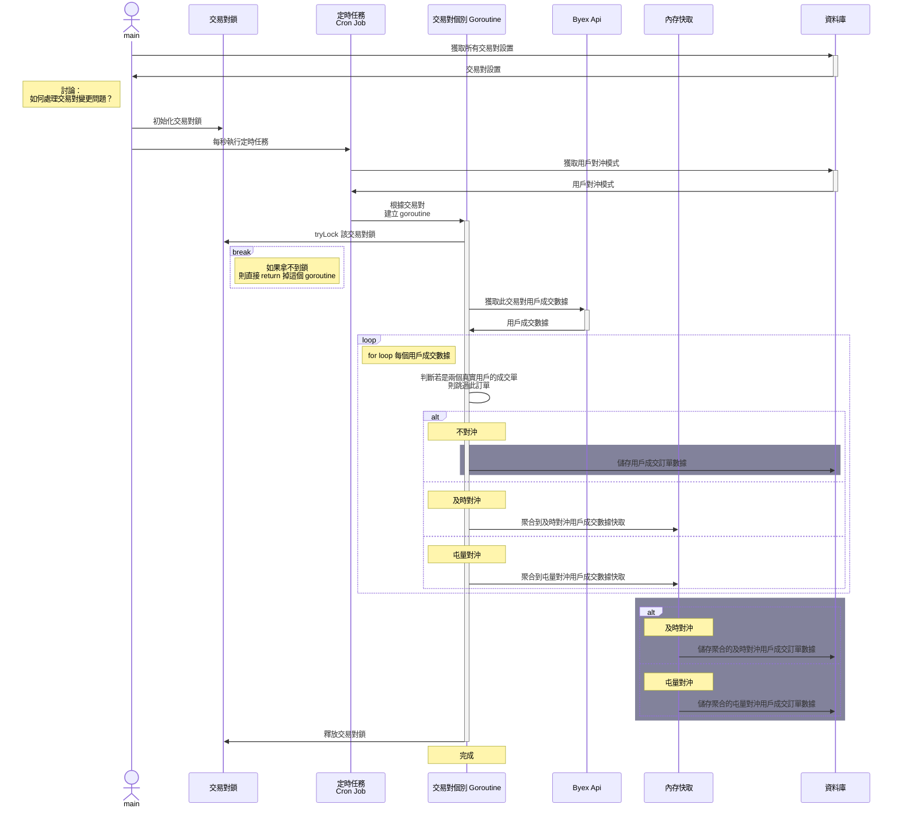

# Hedging

### 定時拉取用戶成交數據

```mermaid
%%{
    init: {
        'markdownAutoWrap': false,
        'flowchart': {
            'wrappingWidth': 1000,
        }
    }
}%%

sequenceDiagram
    actor A as main
    participant Lock as 交易對鎖
    participant Cron as 定時任務<br>Cron Job
    participant Gor as 交易對個別 Goroutine
    participant Api as Byex Api
    participant Cache as 內存快取
    participant DB as 資料庫

    A ->>+ DB: 獲取所有交易對設置
    DB ->>- A: 交易對設置
    note left of A: 討論：<br>如何處理交易對變更問題？

    A ->> Lock: 初始化交易對鎖
    A ->> Cron: 每秒執行定時任務

    Cron ->>+ DB: 獲取用戶對沖模式
    DB ->>- Cron: 用戶對沖模式
    Cron ->>+ Gor: 根據交易對<br>建立 goroutine

    Gor ->> Lock: tryLock 該交易對鎖
    break
        note right of Lock: 如果拿不到鎖<br>則直接 return 掉這個 goroutine
    end

    Gor ->>+ Api: 獲取此交易對用戶成交數據
    Api ->>- Gor: 用戶成交數據

    loop
        note left of Gor: for loop 每個用戶成交數據

        Gor -> Gor: 判斷若是兩個真實用戶的成交單<br>則跳過此訂單

        alt
            note over Gor: 不對沖

            rect rgb(130,130,155)
                Gor ->> DB: 儲存用戶成交訂單數據
            end
        else
            note over Gor: 及時對沖
            Gor ->> Cache: 聚合到及時對沖用戶成交數據快取
        else
            note over Gor: 屯量對沖
            Gor ->> Cache: 聚合到屯量對沖用戶成交數據快取
        end
    end

    rect rgb(130,130,155)
        alt
            note over Cache: 及時對沖
            Cache ->> DB: 儲存聚合的及時對沖用戶成交訂單數據
        else
            note over Cache: 屯量對沖
            Cache ->> DB: 儲存聚合的屯量對沖用戶成交訂單數據
        end
    end

    Gor ->>- Lock: 釋放交易對鎖
    note over Gor: 完成
```
